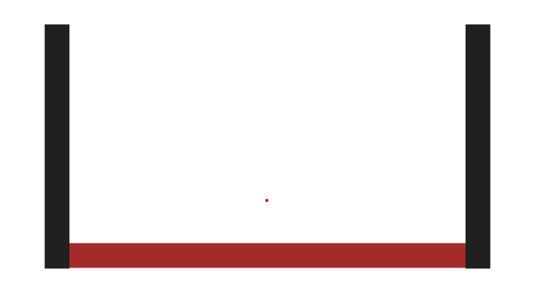

..
    (C) Copyright 2020 Anthony D. Dutoi
    This file is licensed under a Creative Commons Attribution-ShareAlike 4.0
    International License (see http://creativecommons.org/licenses/by-sa/4.0/)

.. include:: <isonum.txt>

Pytoon
======

LOGO (animated svg)

PyToon is a python-based utility for making line-art animations and drawings.

|copy| Copyright 2012, 2013, 2015, 2016, 2018, 2020 Anthony D. Dutoi (tonydutoi@gmail.com)

This is a placeholder
---------------------

I'm experimenting with conversion from ``.md`` to ``.rst``.  Does this image show up?

License
-------

Library source code:  `GPLv3 <http://www.gnu.org/licenses/>`_

Documentation (including this file): `CC-BY-SA <http://creativecommons.org/licenses/by-sa/4.0/>`_

See the file `LICENSE` in this same directory for further information.

.. raw:: html

    

     
    |copy| Copyright 2020 Anthony D. Dutoi
     
    
    &nbsp; This documentation and its components (text, images, and code) are licensed under a
    <a rel="license" href="http://creativecommons.org/licenses/by-sa/4.0/">
    Creative Commons Attribution-ShareAlike 4.0 International License
    </a>.
    

