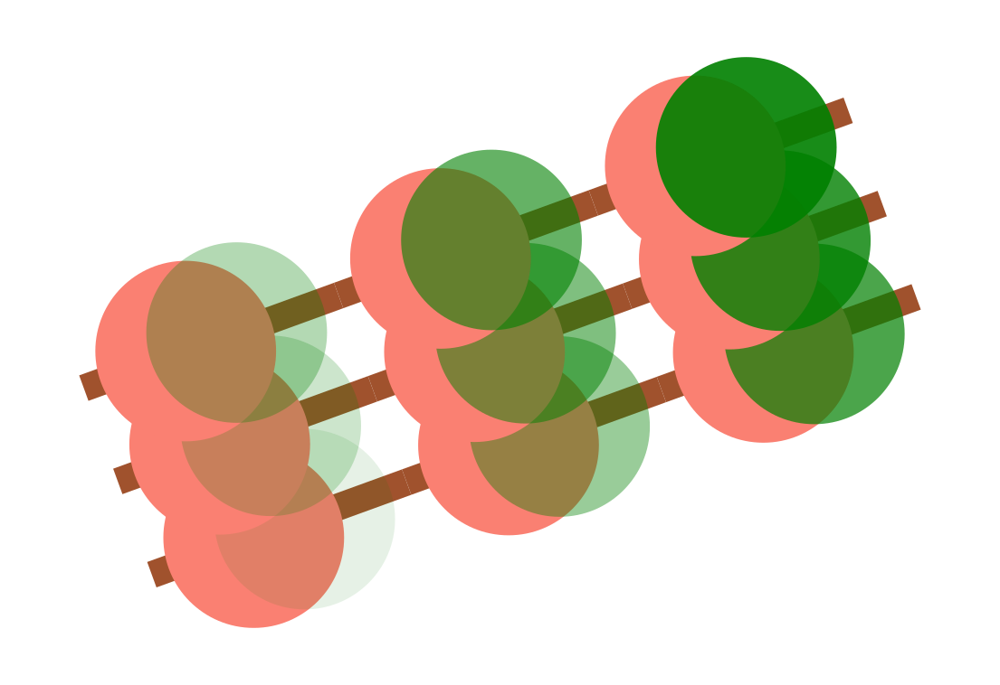

..
    (C) Copyright 2020 Anthony D. Dutoi
    This file is licensed under a Creative Commons Attribution-ShareAlike 4.0
    International License (see http://creativecommons.org/licenses/by-sa/4.0/)

.. role::  raw-html(raw)
    :format: html

PyToon
================================================================================

.. image:: ./docs/samples/5-water-wave/water-wave.svg
  :width: 600
  :align: center
  :alt: waves on water showing elliptical particle trajectories and seaweed

*PyToon* is a python-based utility for making line-art animations and drawings.

Description
-----------

*PyToon* acts like a declarative vector graphics language, composed by 
instantiating and nesting python objects that represent graphical entities.
The motivation is to allow one to use the full power of python to compute
and resolve the image parameters.
It would, for example, be suitable for making complex scientific plots where
some custom plotting feature has not yet been otherwise invented or implemented.

**Features**

* universal defaults and liberal syntax for property specifications
* easy cloning of custom composite entities
* dyanamic customization of entity properties though the use of variables
* arbitrary user-defined transformations of the coordinate space
* animations (also animations of transformations) specified with minimal
  information
* it's light-weight (the *Jupyter* notebook tests and samples outweigh the
  python library source code)

Usage
-----

quick start
^^^^^^^^^^^

.. code-block:: python

    from pytoon import circle

    circle().svg()

.. image:: samples/1-circle/pytoon_graphic.svg
  :width: 400
  :alt: one circle, no fill

The code and resulting image above show the simplest possible use case of
*PyToon*.
The ``.svg`` method renders the image represented by an object of ``circle`` 
class in the `SVG <https://en.wikipedia.org/wiki/Scalable_Vector_Graphics>`_
graphics language, with the default local file name ``pytoon_graphic.svg``.
Failing any supplied arguments, you get a "default circle" (radius of 100 
points, black 1-point outline, with no fill).

The object of ``circle`` class is an example of an *entity*.
An *entity* is any "drawable" object.

composite images
""""""""""""""""

The example above is inherently boring, since there is only one entity in the
image.
A ``composite`` entity is drawable too, and simply draws its components, which
are given in a list (or any other iterable), as so:

.. literalinclude:: ./docs/samples/2-composite/code.py
  :language: python

.. image:: ./docs/samples/2-composite/two-circles.svg
  :width: 600
  :align: center
  :alt: two filled circles over a line, one semi-transparent

Though the syntax for the above is largely self-evident, given that the output
is graphical, a couple of points deserve mention:

* values for the ``lstyle`` and ``fstyle`` arguments, which style lines and
  fills, respectively,
  have a liberal interpretation 
  (covered more later);
  ``0``, ``"none"`` and
  ``False`` would all work to turn off the outlines of the circles, and the 
  order inside the tuple defining the brown line (weight and color,
  respectively) could be swapped.
* color syntax is also flexible; RGB codes or named colors can be used, and the
  ``0.8`` multiplier for the green color causes it to be semi-transparent.
* entities are layered in the order they are defined (last given is on top of
  all others).
* this time, a file name (\ :raw-html:`&rarr; ``two-circles.svg``) is specified for the 
  output.

copy-generated entities
"""""""""""""""""""""""

So far, this is just a declarative graphics language mapped to python, so
let's have
some fun using its python-ness.
To start with, every entity is callable, acting as a generator for copies of
itself.
The call signature is the same as for instantiation, where any supplied
arguments override the "defaults" set by the called object.
So we could have written the above as:

.. literalinclude:: ./docs/samples/2-composite/code-alt.py
  :language: python

variable substitution
"""""""""""""""""""""

This is even more powerful when combined with variable substitution, to adjust
one aspect of a copied ``composite``, for example.

.. literalinclude:: ./docs/samples/3-variables/code.py
  :language: python

To delay the specification of a property, simply set it equal to a string
that obeys the rules for a `valid identifier in python
<https://www.programiz.com/python-programming/keywords-identifier>`_,
such as ``WEIGHT``, ``GREEN``, or ``Two20`` in the forgoing.
When a keyword argument with that identifier is later passed to a
copy-generator call, or to a ``composite`` that contains that object, the
value of that argument is substituted.
The seemingly pointless use of ``Two20`` is just to demonstrate that this
works pretty much everywhere, all the time.
Capitalizing at least the
first letter is one way to eliminate name clashes with standard properties of
entity classes.

simple transformations
""""""""""""""""""""""

In the above example, we also see the ``.T`` and ``.R`` methods of entities
being called.  These are shorthand for "translate" and "rotate," respectively,
and their effect is to return a copy of the entity, transformed as specified.
There is also a ``.S`` method that scales the image.

animation
"""""""""

One of the most powerful features is the way that the heavy lifting is done by
python to translate arbitrary user-defined functions into animation paths and
attributes.

.. literalinclude:: ./docs/samples/4-animation/code.py
  :language: python

.. image:: ./docs/samples/4-animation/pytoon_graphic.svg
  :width: 600
  :align: center
  :alt: black circle going back and forth on a tan background

*(As embedded, this animation plays with no user interaction.  Click the image
to open it by itself, and use the space bar to start/stop.  More is said
about control later.)*

The user-defined function ``c`` in the code above defines an oscillatory
trajectory.
The time argument for such a function must be named ``_t_`` (to stay out of the
way of any variables a user might want to define).
The snippet ``center=animated(c,Dt=0.05)`` is where the function ``c`` is
applied specifically to the center of the circle.
The user, generally aware of the contents of ``c`` decides on the time step
(``Dt=0.05``) necessary for a good rendering of this trajectory.
All the rest is figured out by *PyToon*.

The time interval to be rendered 
(``_t_`` |rarr| ``0`` through ``_t_`` |rarr| ``1``)
is specified by the ``time=(0,1)`` argument to the ``.svg`` call.  This
"internal" time is in arbitrary units of the user's choice, but the rendered 
interval will play out over 2 seconds of real time, as specified by 
``duration=2``.

grand finale
""""""""""""

.. image:: ./docs/samples/5-water-wave/water-wave.svg
  :width: 600
  :align: center
  :alt: waves on water showing elliptical particle trajectories and seaweed

So much for the simple.  How about the complex?
The above image (about 2 MB, rendered) was generated by about 50 lines of 
python code, about half
of which were needed to compute the dynamic, area-conserving transformation
that physically defines the wave.  Except for importing ``pytoon`` and things
from the standard library, it is completely free-standing
(the code appears in the dicussion of tranformations).
Notice how the centers of the circles move with the distortion field that 
makes the background wave, but they are not themselves distorted (unlike the
seaweed).  You have that much control!

full documentation
^^^^^^^^^^^^^^^^^^

After cloning, point your browser to the file `docs/html/index.html` 
(also hosted on 
`ReadTheDocs <https://pytoon-draw-with-python.readthedocs.io/en/latest/>`_).
See also the `docs/samples/` directory.

Installation
------------

Aside from cloning this and making sure the project directory is in your Python
search path,  just hang on while I pip-ify it (today = 5.Nov.2020).

dependencies
^^^^^^^^^^^^

If you only want to render to svg, then none.  If you want to output to jpg or
pdf (static images only), then ImageMagick and Inkscape will need to be 
available in the environment.

So far this has only been tested for python>=3.7 on *nix systems (specifically
Linux/Mac).

support
^^^^^^^

Email tonydutoi@gmail.com, and I'll do what I can.

Testing and Development
-----------------------

testing
^^^^^^^

In the ``tests/`` directories there are some *Jupyter* notebook ``.ipynb``
files, each with some in-place instructions on what is being tested.

contributing
^^^^^^^^^^^^

In theory, I welcome collaboration.
In practice, you will have to be very self-sufficient and patient, as this 
is an intermittent side project.
If this project catches your interest, and you can work like that, great!

to-do list
^^^^^^^^^^

* This list
* is on
* the to-do list.

Copyright and License
---------------------

:raw-html:`&copy;` Copyright 2012, 2013, 2015, 2016, 2018, 2020 Anthony D. Dutoi (tonydutoi@gmail.com)

| Library source code:  `GPLv3 <http://www.gnu.org/licenses/>`_
| Documentation (including this file): `CC-BY-SA <http://creativecommons.org/licenses/by-sa/4.0/>`_
| See the `LICENSE` file in this same directory for further information.

----

.. raw:: html

    

     
    &copy; Copyright 2020 Anthony D. Dutoi
     
    
    &nbsp; This documentation and its components (text, images, and code) are licensed under a
    <a rel="license" href="http://creativecommons.org/licenses/by-sa/4.0/">
    Creative Commons Attribution-ShareAlike 4.0 International License
    </a>.
    

