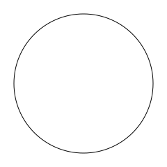

PyToon Documentation
====================

.. toctree::
   :maxdepth: 2
   :caption: Contents:

.. literalinclude:: samples/1-circle/code.py
  :language: python

The code and resulting image above show the simplest possible use case of *PyToon*.
An object of class ``circle`` is instantiated, and the ``.svg`` method renders it in the `SVG <https://en.wikipedia.org/wiki/Scalable_Vector_Graphics>`_
graphics language, with the default local filename ``pytoon_graphic.svg``.

composite images
^^^^^^^^^^^^^^^^

The example above is inherently boring, since there is only one entity in the image (the circle), but it hints at some of the underlying structure.
All entities are "drawable".  A composite image is drawable too, and simply draws its components, which are given in a list (or any other iterable),
as so:

.. literalinclude:: samples/2-composite/code.py
  :language: python

.. image:: samples/2-composite/two-circles.svg
  :width: 400
  :align: center
  :alt: two filled circles over a line, one semi-transparent

Though the syntax for the above is largely self-evident, given the fact that the output is graphical, a couple of points deserve mention:

* the ``lstyle`` and ``fstyle`` arguments have a liberal interpretation (covered more below); ``0``, ``"none"`` and ``None`` would also have worked to turn off the outlines of the circles, and even the order in the tuple defining the blue line (weight and color, respectively) could be swapped.
* color syntax is also flexible; RGB codes or named colors can be used, and the ``0.8`` multiplier for the green color causes it to be semi-transparent.
* entities are layered in the order they are defined (last given is on top of all others).
* this time, a file name (``two-circles.svg``) is specified for the result.

copy-generated entities
^^^^^^^^^^^^^^^^^^^^^^^

This is still not much better than a declarative graphics language mapped to python, so let's now have some fun using its python-ness.
To start with, every object (instantiation of an entity class, like ``line``, ``circle``, or ``composite``) is callable, acting as a generator for copies of itself.
The call signature is exactly the same as for instantiation, where any supplied arguments override the "defaults" set by the called object.
So we could have written the above as:

.. literalinclude:: samples/2-composite/code-alt.py
  :language: python

variable substitution
^^^^^^^^^^^^^^^^^^^^^

This is even more powerful when combined with variable substitution, to, say, adjust one aspect of a copied composite

.. literalinclude:: samples/3-variables/code.py
  :language: python

.. image:: samples/3-variables/pytoon_graphic.svg
  :width: 400
  :align: center
  :alt: repetition of two circles over a line, with different transparencies of green

To delay the specification of a property, simply set it equal to a string that obeys the rules for a `valid identifier in python <https://www.programiz.com/python-programming/keywords-identifier>`_,
such as ``WEIGHT`` or ``GREEN`` in the forgoing.
When a keyword argument with that identifier is later passed to the the copy-generator call or to a composite that contains that object, the value of that argument is substituted.
These identifiers need not be all upper-case, but capitalizing at least the first letter eliminates name clashes with any of the standard arguments.

transformations
^^^^^^^^^^^^^^^

In the above example, we also see the ``.T`` and ``.R`` methods of entities being called.  These are shorthand for "translate" and "rotate," respectively,
and their effect is to return a copy of the entity transformed as specified.  There is also a ``.S`` method that scales the image.

animation
^^^^^^^^^

.. literalinclude:: samples/4-animation/code.py
  :language: python

.. image:: samples/4-animation/pytoon_graphic.svg
  :width: 400
  :align: center
  :alt: black circle going back and forth on a tan background
